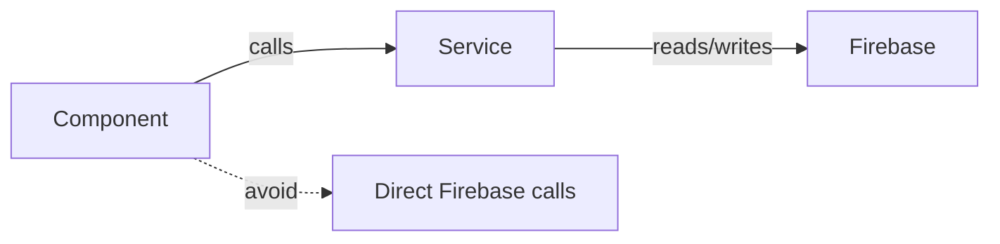

# Agents Wiki
Last updated: 2025-12-19

This document contains coding standards, conventions, and best practices for this repository. **Read this before making any code changes.**

---

## Coding Standards

### React & Hooks

> [!CAUTION]
> **Rules of Hooks**: STRICTLY OBSERVE. Do not call hooks conditionally (inside `if`, loops, or after early returns). This is a **major issue** in `src/App.jsx` — there are 30+ hook violation errors in the current lint output.

```javascript
// ❌ WRONG - Conditional hook call
function MyComponent({ showFeature }) {
  if (!showFeature) return null;
  const [state, setState] = useState(false); // Hook after early return!
}

// ✅ CORRECT - All hooks at top level
function MyComponent({ showFeature }) {
  const [state, setState] = useState(false);
  if (!showFeature) return null;
}
```

**Key rules**:
- All `useState`, `useEffect`, `useMemo`, `useCallback`, `useRef` calls must be at the **top level** of the component
- Never call hooks inside conditionals, loops, or nested functions
- Never call hooks after early `return` statements

### State Management

| Level | Use |
|-------|-----|
| Local state (`useState`) | UI interactions (modals, tabs, form fields) |
| Context (`useContext`) | App-wide state (sites, auth, employees) |
| Derived state (`useMemo`) | Computed values from existing state |

**Avoid**:
- Calling `setState` synchronously inside `useEffect` bodies — causes infinite render loops
- Putting functions in dependency arrays without `useCallback`
- Missing dependencies in `useEffect` arrays

### Styling

- **Tailwind CSS**: Use utility classes. Do not create new CSS files.
- `src/App.css` is slated for deletion — do not add styles there.
- Prefer Tailwind's responsive prefixes (`sm:`, `md:`, `lg:`) for breakpoints.
- Use `clsx` for conditional class names (already in dependencies).

### TypeScript vs JavaScript

| Module | Language |
|--------|----------|
| Quoting (`src/apps/quoting/`) | TypeScript (`.ts`, `.tsx`) |
| Everything else | JavaScript (`.js`, `.jsx`) |

**Respect the file's language**. When editing TypeScript files, maintain type annotations.

---

## Service Layer Pattern



### Where to put code

| Type | Location | Example |
|------|----------|---------|
| Business logic | `src/services/` | `inventoryService.js`, `costingService.js` |
| UI components | `src/components/` | Display-focused, call services |
| Data access | `src/services/` (preferred) or `src/repositories/` | CRUD operations |
| Pure functions | `src/utils/` | Formatting, calculations |
| Constants | `src/constants/` | Static values, icon components |
| Shared state | `src/context/` | React Context providers |
| Custom hooks | `src/hooks/` | Wrappers around contexts |

### Services vs Repositories

Both patterns exist in this codebase:

- **Services** (`src/services/`): The **modern, preferred** pattern. Contains business logic and Firebase calls.
- **Repositories** (`src/repositories/`): Older pattern with `BaseRepository` abstract class. Still used for products, customers, quotes.

**Recommendation**: Use services for new code. Repositories are acceptable but check existing patterns first.

---

## Folder Responsibilities

| Folder | Purpose |
|--------|---------|
| `src/apps/` | Top-level containers for different "apps" (Inventory, Quoting, Portal) |
| `src/components/` | Reusable UI widgets (modals, tables, cards) |
| `src/components/inventory/` | Parts catalog, products, BOM, stock management |
| `src/components/reports/` | Service reports, PDF generation |
| `src/components/settings/` | App settings panels |
| `src/components/admin/` | User management |
| `src/services/` | API calls, Firebase interaction, business logic |
| `src/context/` | State shared across the entire application tree |
| `src/hooks/` | Custom hooks (thin wrappers around contexts) |
| `src/utils/` | Pure functions (date formatting, validation, calculations) |
| `src/constants/` | Static values, icons, category definitions |
| `src/repositories/` | Data access layer (legacy pattern) |
| `src/data/` | Mock data for testing |
| `src/_archive/` | Deprecated code (safe to ignore) |

---

## Firebase Best Practices

### Singleton Import

> [!IMPORTANT]
> Always import `db`, `auth`, `storage` from `src/firebase.js`, not the Firebase SDK directly.

```javascript
// ✅ CORRECT
import { db, auth, storage } from '../firebase';

// ❌ WRONG - Creates new Firebase instance
import { getFirestore } from 'firebase/firestore';
```

### Environment Variables

Never hardcode API keys. Use:
```javascript
import.meta.env.VITE_FIREBASE_API_KEY
```

### Firestore Patterns

```javascript
// Collection reference
const partsRef = collection(db, 'parts');

// Document reference
const partRef = doc(db, 'parts', partId);

// Real-time listener
const unsubscribe = onSnapshot(partsRef, (snapshot) => {
  const data = snapshot.docs.map(doc => ({ id: doc.id, ...doc.data() }));
});

// Don't forget cleanup!
return () => unsubscribe();
```

---

## Inventory Module Conventions

### Part Structure
```javascript
{
  id: 'auto-generated',
  name: 'Hex Bolt M8x25',
  sku: 'FAS-HEX-M8-25',
  category: 'Fasteners',
  description: '...',
  suppliers: [
    { supplierId: '...', supplierName: '...', costPrice: 0.45, sku: 'SUP-SKU', isPreferred: true }
  ],
  stockLevel: 100,
  reorderPoint: 20,
  location: 'Warehouse A',
  createdAt: Timestamp,
  updatedAt: Timestamp
}
```

### Product with BOM
```javascript
{
  id: 'auto-generated',
  name: 'Assembly Kit',
  sku: 'PRD-ASM-001',
  bom: [
    { partId: '...', partName: '...', quantityRequired: 4 }
  ],
  costType: 'Calculated', // or 'Manual'
  manualCost: null,
  calculatedCost: 12.50,
  createdAt: Timestamp
}
```

### BOM Quantity Rules
- Quantities must be **whole numbers only** (integers)
- Enforced in `BOMEditor.jsx` with `step="1"` and validation

---

## How We Do Things Here

### Adding a New Feature

1. **Plan**: Update `docs/` if adding major modules
2. **Service**: Create/update service in `src/services/`
3. **Component**: Build UI in `src/components/`
4. **Context**: Only if state needs app-wide sharing
5. **Test**: Add unit tests in `__tests__/` folders
6. **Lint**: Run `npm run lint` before committing

### Adding a New Service

```javascript
// src/services/myService.js
import { db } from '../firebase';
import {
  collection,
  doc,
  getDocs,
  addDoc,
  updateDoc,
  deleteDoc,
} from 'firebase/firestore';

const COLLECTION = 'myCollection';

export const getAll = async () => {
  const snapshot = await getDocs(collection(db, COLLECTION));
  return snapshot.docs.map(doc => ({ id: doc.id, ...doc.data() }));
};

export const create = async (data) => {
  const docRef = await addDoc(collection(db, COLLECTION), {
    ...data,
    createdAt: serverTimestamp(),
  });
  return docRef.id;
};

// ... etc
```

### Adding a Modal Component

1. Create in `src/components/` or appropriate subfolder
2. Accept `isOpen`, `onClose` props
3. Use the existing modal patterns from `UIComponents.jsx`
4. Call service functions for data operations
5. Handle loading and error states

---

## Gotchas & Known Issues

### 1. Conditional Hook Calls in App.jsx

The main `App.jsx` file has **30+ React Hook violations**. This is technical debt that should be addressed by moving hooks above early returns.

### 2. setState in useEffect

Multiple components call `setState` synchronously in `useEffect`:
- `ContextWizardModal.jsx`
- `EditCalibrationModal.jsx`
- `ManualCalibrationModal.jsx`
- `ServiceReportForm.jsx`
- `GlobalDataContext.jsx`

**Fix**: Use functional updates or restructure to avoid cascading renders.

### 3. Undefined Variables in SiteModals.jsx

`SiteModals.jsx` references undefined CSS class variables (`labelClass`, `inputClass`, `sectionClass`). These need to be defined or replaced with Tailwind classes.

### 4. Duplicate Exports

PDF components have both named and default exports:
- `FullDashboardPDFPreview.jsx`
- `ScheduleChartPDFPreview.jsx`
- `AssetSpecsPDFPreview.jsx`
- `MasterListPDFPreview.jsx`

**Fix**: Choose one export style (named OR default) and update consumers.

### 5. Ghost Code

There is significant unused code (see `CLEANUP-REPORT.md`):
- 9 unused files
- 47 unused exports
- 5 unused dependencies

**Don't assume a file is active just because it exists**. Check references first.

### 6. Mixed Language Files

The quoting module is TypeScript while everything else is JavaScript. Don't convert files between languages without a deliberate migration plan.

### 7. Large App.jsx File

`src/App.jsx` is ~125KB. Consider splitting into smaller modules when adding features.

---

## Code Review Checklist

Before submitting changes:

- [ ] Run `npm run lint` — fix all new errors
- [ ] Run `npm run test` — ensure tests pass
- [ ] Hooks are at top level (no conditional calls)
- [ ] Firebase imports from `src/firebase.js`
- [ ] No hardcoded API keys or secrets
- [ ] New services follow existing patterns
- [ ] Complex logic has comments
- [ ] Error states are handled in UI
- [ ] Loading states shown during async operations

---

## Related Documentation

- [`PROJECT_MAP.md`](./PROJECT_MAP.md) - Repository structure and entry points
- [`ERROR_INDEX.md`](./ERROR_INDEX.md) - Common errors and fixes
- [`CLEANUP-REPORT.md`](../CLEANUP-REPORT.md) - Unused code analysis
