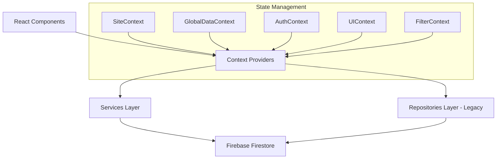

# Project Map
Last updated: 2025-12-19

## Overview
This repository contains a **React-based business application suite** for inventory, asset maintenance, and quoting. Key features include:

1. **Inventory & Maintenance App** (`InventoryApp.jsx`): Asset management, parts catalog, product catalog with BOM, stock control, and service tracking.
2. **Quoting System** (`src/apps/quoting/`): Estimation and pricing logic (TypeScript).
3. **Customer Portal** (`src/apps/CustomerPortal/`): Client-facing dashboard.
4. **Employee Manager** (`EmployeeManager.jsx`): Staff credentials and compliance tracking.

**Tech Stack**:
- **Build**: Vite 7.x
- **Framework**: React 19.x
- **Backend**: Firebase (Firestore, Auth, Storage)
- **Styling**: Tailwind CSS 3.x
- **Testing**: Vitest (unit), Playwright (e2e)
- **PDF**: @react-pdf/renderer, pdfjs-dist

---

## Repository Structure

```text
/
├── .github/                # CI/CD workflows
├── docs/                   # Developer documentation (You are here)
│   ├── AGENTS_WIKI.md      # Coding standards & conventions
│   ├── ERROR_INDEX.md      # Common errors & fixes
│   └── PROJECT_MAP.md      # This file
├── public/                 # Static assets
├── src/
│   ├── App.jsx             # Main router/controller (~125KB, large file!)
│   ├── Portal.jsx          # Simple portal view
│   ├── main.jsx            # Entry point
│   ├── firebase.js         # Firebase initialization (singleton)
│   ├── index.css           # Global styles
│   ├── apps/               # Top-level application containers
│   │   ├── InventoryApp.jsx         # Main inventory management app
│   │   ├── MaintenanceWrapper.jsx   # Maintenance scheduling
│   │   ├── CustomerPortal/          # Customer-facing app
│   │   ├── employees/               # Employee management module
│   │   └── quoting/                 # Quoting module (TypeScript)
│   │       ├── QuotingWrapper.tsx   # Entry point
│   │       ├── components/          # Quote UI components
│   │       ├── hooks/               # Quote-specific hooks
│   │       ├── logic.ts             # Pricing calculations
│   │       ├── types.ts             # TypeScript interfaces
│   │       └── utils/               # Tax year utilities
│   ├── components/         # Shared UI components
│   │   ├── inventory/      # Parts, Products, Stock, BOM, Suppliers
│   │   ├── reports/        # Service reports, PDF generation
│   │   ├── settings/       # Settings panels
│   │   ├── admin/          # User management
│   │   └── ...             # Modals, widgets, analytics
│   ├── context/            # React Context providers
│   │   ├── AuthContext.jsx          # Firebase Auth state
│   │   ├── GlobalDataContext.jsx    # Customers, employees, global state
│   │   ├── SiteContext.jsx          # Sites, assets, maintenance data
│   │   ├── FilterContext.jsx        # Search/filter state
│   │   ├── UIContext.jsx            # Modal and UI state
│   │   └── UndoContext.jsx          # Undo/redo stack
│   ├── hooks/              # Custom React hooks
│   │   ├── useFilterContext.js
│   │   ├── useSiteContext.js
│   │   ├── useUIContext.js
│   │   └── useUndo.js
│   ├── services/           # Business logic & Firebase interactions
│   │   ├── inventoryService.js      # Parts CRUD, stock movements
│   │   ├── productService.js        # Products CRUD
│   │   ├── costingService.js        # BOM cost calculations
│   │   ├── partPricingService.js    # Part price history
│   │   ├── categoryService.js       # Categories & locations
│   │   ├── settingsService.js       # App settings
│   │   └── initInventory.js         # Bootstrap inventory data
│   ├── repositories/       # Data access layer (legacy pattern)
│   │   ├── BaseRepository.js        # Abstract CRUD base
│   │   ├── CustomerRepository.js
│   │   ├── SiteRepository.js
│   │   ├── EmployeeRepository.js
│   │   ├── ProductRepository.js
│   │   ├── ProductCompositionRepository.js
│   │   ├── PartCostHistoryRepository.js
│   │   ├── ProductCostHistoryRepository.js
│   │   ├── QuoteRepository.js
│   │   └── index.js                 # Barrel exports
│   ├── utils/              # Pure helper functions
│   │   ├── dateHelpers.js           # Date formatting
│   │   ├── costForecasting.js       # Predictive cost analysis
│   │   ├── skuGenerator.js          # Auto-generate SKUs
│   │   ├── validation.ts            # Input validation
│   │   ├── helpers.js               # General utilities
│   │   ├── filterUtils.js           # Search/filter logic
│   │   ├── dataUtils.js             # Local storage helpers
│   │   ├── employeeUtils.js         # Employee compliance
│   │   ├── siteHealth.js            # Site health calculations
│   │   ├── pdfParser.js             # PDF text extraction
│   │   └── __tests__/               # Unit tests
│   ├── constants/          # Static values
│   │   ├── icons.jsx                # Icon components
│   │   ├── inductionCategories.js   # Employee induction types
│   │   └── uiConstants.js           # UI configuration
│   ├── data/               # Mock/seed data
│   │   └── mockData.js
│   ├── assets/             # Images, logos
│   ├── _archive/           # Deprecated code (safe to ignore)
│   └── test/               # Test utilities
├── tests/                  # E2E tests (Playwright)
├── .env.example            # Environment variable template
├── firebase.json           # Firebase Hosting/Functions config
├── firestore.indexes.json  # Firestore composite indexes
├── package.json            # Dependencies and scripts
├── vite.config.js          # Build configuration
├── vitest.config.js        # Unit test configuration
├── playwright.config.ts    # E2E test configuration
├── tailwind.config.js      # Tailwind theme extensions
├── eslint.config.js        # Linting rules
└── CLEANUP-REPORT.md       # Unused code analysis
```

---

## Key Entry Points

| Purpose | File |
|---------|------|
| **Runtime Entry** | `src/main.jsx` → mounts `src/App.jsx` |
| **All-in-One Controller** | `src/App.jsx` (routing, state, main dashboard) |
| **Inventory App** | `src/apps/InventoryApp.jsx` |
| **Quoting Module** | `src/apps/quoting/QuotingWrapper.tsx` |
| **Customer Portal** | `src/apps/CustomerPortal/CustomerApp.jsx` |
| **Firebase Init** | `src/firebase.js` (singleton for `db`, `auth`, `storage`) |

---

## Commands

All commands are run via `npm`:

| Command | Description |
|---------|-------------|
| `npm run dev` | Start local development server (Vite, port 3000 by default). |
| `npm run build` | Build for production (outputs to `dist/`). ~12s build time. |
| `npm run lint` | Run ESLint. Currently 163 errors, 8 warnings. |
| `npm run test` | Run unit tests with Vitest. |
| `npm run test:watch` | Run tests in watch mode. |
| `npm run test:coverage` | Generate coverage report. |
| `npm run test:e2e` | Run end-to-end tests with Playwright. |
| `npm run test:e2e:headed` | Run Playwright tests with visible browser. |
| `npm run preview` | Preview production build locally. |
| `npm run deploy` | Build and deploy to Firebase Hosting. |
| `npm run deploy:preview` | Deploy to a preview channel. |

---

## Configuration & Environment

### Environment Variables (`.env`)

Copy `.env.example` to `.env` and populate:

```bash
VITE_FIREBASE_API_KEY=your-api-key-here
VITE_FIREBASE_AUTH_DOMAIN=your-project-id.firebaseapp.com
VITE_FIREBASE_PROJECT_ID=your-project-id
VITE_FIREBASE_STORAGE_BUCKET=your-project-id.appspot.com
VITE_FIREBASE_MESSAGING_SENDER_ID=your-sender-id
VITE_FIREBASE_APP_ID=your-app-id
VITE_FIREBASE_MEASUREMENT_ID=your-measurement-id
```

Access via `import.meta.env.VITE_*`.

### Configuration Files

| File | Purpose |
|------|---------|
| `vite.config.js` | Port setup, React plugin, build options |
| `tailwind.config.js` | Theme extensions, content paths |
| `eslint.config.js` | Linting rules (strict Hooks checking) |
| `firebase.json` | Hosting rewrites, headers |
| `firestore.indexes.json` | Composite indexes for queries |

---

## Data Flow



1. **Components**: Trigger actions, display data.
2. **Context**: Shared state via `SiteContext`, `GlobalDataContext`, etc.
3. **Services**: Business logic & Firebase calls in `src/services/`.
4. **Repositories**: Older data access layer in `src/repositories/`. Services are the preferred modern pattern.
5. **Firebase**: Firestore for data, Auth for users, Storage for files.

---

## Major Modules

### Inventory Module (`src/components/inventory/`)

| Component | Purpose |
|-----------|---------|
| `PartCatalogModal.jsx` | Create/edit parts with pricing, suppliers, SKU |
| `PartCatalogTable.jsx` | Parts list with search, filter, sort |
| `PartPricingTab.jsx` | Historical price tracking |
| `ProductCatalogModal.jsx` | Create/edit products |
| `ProductCatalogTable.jsx` | Products list view |
| `BOMEditor.jsx` | Bill of Materials editor |
| `ProductCostToggle.jsx` | Manual vs calculated cost mode |
| `FastenerCatalogModal.jsx` | Specialized fastener management |
| `StockOverview.jsx` | Stock levels dashboard |
| `StockAdjustmentModal.jsx` | Manual stock adjustments |
| `StockTakeMode.jsx` | Physical inventory counting |
| `StockMovementHistory.jsx` | Movement audit trail |
| `SerializedAssetsView.jsx` | Serialized item tracking |
| `CategoryManager.jsx` | Category CRUD |
| `LocationManager.jsx` | Location CRUD |
| `SupplierManager.jsx` | Supplier CRUD |
| `ListPriceToggle.jsx` | Toggle list price display |

### Quoting Module (`src/apps/quoting/`)

Written in **TypeScript**. Key files:
- `QuotingWrapper.tsx`: Entry point
- `logic.ts`: Pricing calculations, duration helpers
- `types.ts`: Quote, LineItem interfaces
- `hooks/useQuote.ts`: Quote state management

### PDF/Reports (`src/components/reports/`)

- `ServiceReportDocument.jsx`: PDF document component
- `ServiceReportForm.jsx`: Report data entry
- `ServiceReportPDF.tsx`: PDF renderer
- Tab components for multi-section reports

---

## Firestore Collections

| Collection | Purpose | Key Fields |
|------------|---------|------------|
| `sites` | Customer sites | `name`, `customer`, `location`, `contacts` |
| `assets` | Equipment/machinery | `name`, `code`, `frequency`, `lastCalibration` |
| `customers` | Business customers | `name`, `email`, `phone` |
| `employees` | Staff records | `name`, `inductions`, `expiryDates` |
| `parts` | Inventory parts | `name`, `sku`, `category`, `suppliers[]` |
| `products` | Manufactured products | `name`, `sku`, `bom[]` |
| `part_cost_history` | Part price history | `partId`, `costPrice`, `effectiveDate` |
| `product_cost_history` | Product cost history | `productId`, `cost`, `costType` |
| `categories` | Part categories | `name`, `description` |
| `locations` | Storage locations | `name`, `address` |
| `suppliers` | Supplier companies | `name`, `contact`, `email` |
| `quotes` | Price quotes | `customer`, `lineItems[]`, `total` |

---

## Known Technical Debt

1. **App.jsx is 125KB**: Consider splitting into smaller modules.
2. **Hook violations**: Conditional hook calls in `App.jsx` (see ERROR_INDEX.md).
3. **Unused code**: See `CLEANUP-REPORT.md` for 47 unused exports, 9 unused files.
4. **Mixed languages**: Most codebase is JavaScript; quoting module is TypeScript.
5. **Lint errors**: 163 errors, 8 warnings in current lint output.
6. **Failing test**: `SiteContext.test.jsx` has 1 failing assertion.

---

## Related Documentation

- [`AGENTS_WIKI.md`](./AGENTS_WIKI.md) - Coding standards and conventions
- [`ERROR_INDEX.md`](./ERROR_INDEX.md) - Common errors and fixes
- [`CLEANUP-REPORT.md`](../CLEANUP-REPORT.md) - Unused code analysis
- [`INSTALLATION_GUIDE.md`](../INSTALLATION_GUIDE.md) - User installation guide
